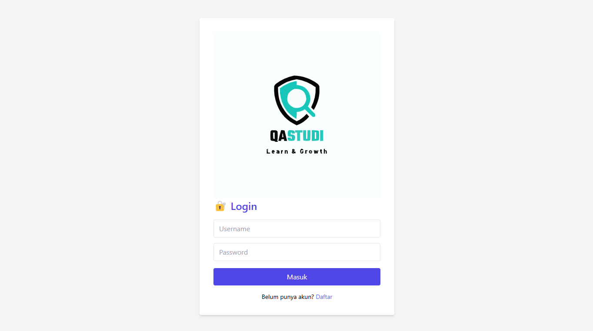
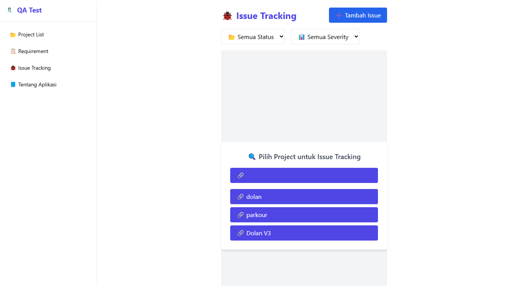
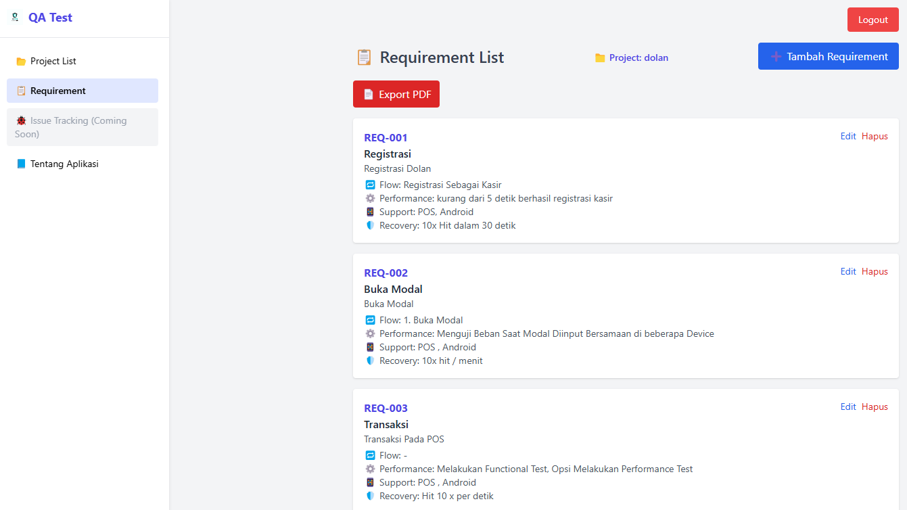
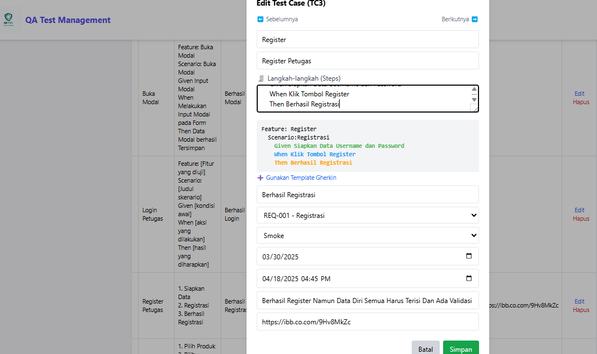
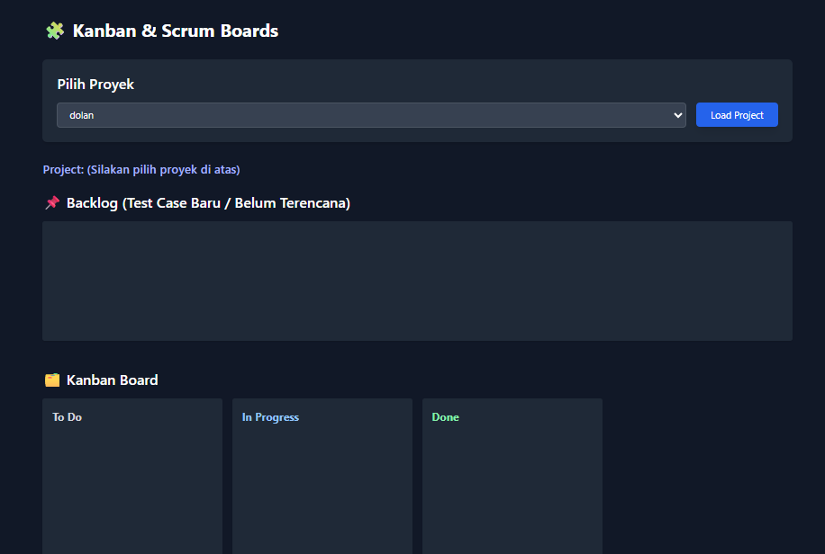
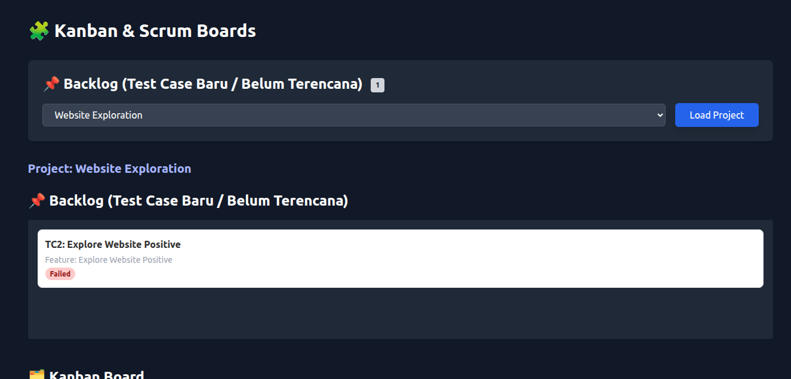
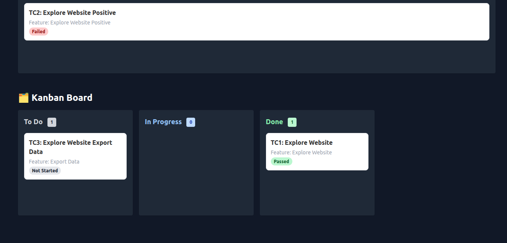

# 🧪 QA Test Management Platform (Web Based)

Platform web modern untuk manajemen test case, requirement, issue tracking, dan pelaporan QA secara terintegrasi. Mudah digunakan untuk tim QA, baik skala kecil maupun besar.

---

## 📸 Preview









---

## 🌟 Fitur Utama

- ✅ **Test Case Management**
  - CRUD test case per project
  - Kategori: Smoke, Regression, Functional
  - Status eksekusi: Not Started, In Progress, Passed, Failed, Blocked, Retested
  - Versi, notes, log testing
  - Export ke CSV, XLSX, PDF
  - Navigasi, filter, dan search

- 📋 **Requirement Management**
  - CRUD requirement (ID unik, judul, deskripsi, user flow, dsb)
  - Upload diagram (image preview)
  - Link otomatis ke test case
  - Hitung jumlah test case per requirement
  - Export ke PDF

- 🐞 **Issue Tracking**
  - CRUD issue per project
  - Filter by Status & Severity
  - Link otomatis dari test case gagal ("Laporkan ke Issue")
  - Upload screenshot/file
  - Auto-populate issue dari test case gagal
  - Dashboard ringkasan

- 📊 **Reporting & Matriks**
  - Pie/Bar chart hasil test case
  - Execution timeline
  - AI Summary & Suggestion (opsional/eksperimental)
  - Matriks coverage requirement → test case
  - Navigasi langsung dari matriks ke test case
  - Export PDF

- 🔐 **Auth & Multi-Project**
  - Login sederhana (localStorage)
  - Pemilihan & setup project
  - Proteksi halaman jika belum login
  - Export project setup ke PDF

---

## 🚀 Cara Menjalankan

1. **Clone repo:**
   ```bash
   git clone https://github.com/username/qa-test-management.git
   cd qa-test-management
   ```
2. **Jalankan secara lokal:**
   - Buka file `index.html` di browser
   - Atau gunakan ekstensi Live Server di VSCode
   - Tidak perlu backend/server khusus (pure HTML/JS)

---

## 📁 Struktur Folder

- `assets/js/` — Seluruh file JavaScript
- `assets/img/` — Gambar & screenshot
- `assets/css/` — (Jika ada) file CSS custom
- `index.html` — Halaman utama
- dst.

---

## 🤝 Kontribusi

Pull request sangat diterima! Silakan buat issue/PR untuk fitur/bug.

---

## 📄 Lisensi

MIT License
